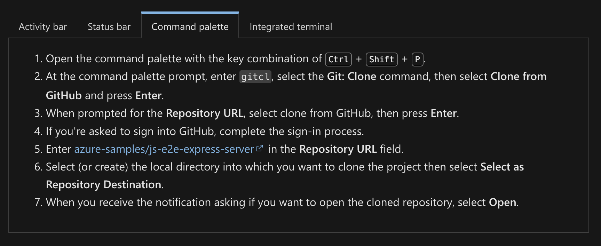

# SBS-BESI
**BESI** stands for **B**eam forces **E**xtract-**S**ort-**I**mport 

It is an app for automating the workflow by SBS engineers usually performed *in between* STAAD and SPCOL

# Usage
> this tutorial is intended for Windows users.
1. Install VSCode [here](https://code.visualstudio.com/download).

2. Install Python 3.11 by downloading installer [here](https://www.python.org/ftp/python/3.11.5/python-3.11.5-amd64.exe). You can follow the instructions in [this article](https://bigblue.academy/en/how-to-download-python-for-windows-step-by-step#:~:text=To%20install%20Python%20via%20winget,version's%20ID%20to%20install%20it.). (Follow Method #1)

3. Install the poetry python package via command prompt
```shell
> pip install poetry
```

4. Clone this github repository in VSCode by following the instructions below


Use this when asked for the repository URL: https://github.com/SBStruc/SBS-BESI.git

5. In VSCode, open the folder containing 


# Flowchart

#  Development

# Configuration

# Roadmap